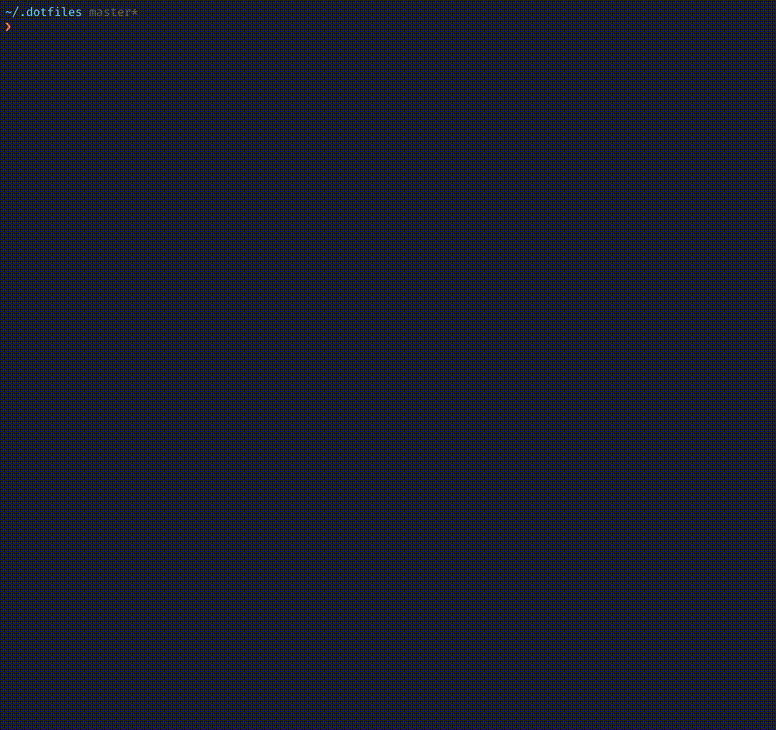

<p align="center">
    <a href="https://github.com/mitinarseny/dots">
        
    </a>
    <h1 align="center">dots</h1>
    <p align="center">Delivery tool for your <code>.dotfiles</code></p>
    <p align="center">
      <a href="https://github.com/mitinarseny/dots/releases/latest"></a>
      <a href="https://travis-ci.org/mitinarseny/dots"></a>
      <a href="https://codecov.io/gh/mitinarseny/dots"></a>
      <a href="https://golangci.com/r/github.com/mitinarseny/dots"></a><br>
      <a href="http://godoc.org/github.com/mitinarseny/dots"></a>
      <a href="/LICENSE.md"></a>
      <a href="https://saythanks.io/to/mitinarseny"></a>
      <a href="https://houndci.com"></a> 
    </p>
</p>

[](https://github.com/mitinarseny/dotfiles/blob/master/.dots.yaml)

---

## Table of Contents:
* [Installation](#installation)
* [Usage](#usage)
* [Config file](#config-file)

## Installation

### macOS
```bash
brew install mitinarseny/tap/dots
```

## Usage
To set variables, create symlinks and execute commands listed in [config](#config) file run this: 
```bash
dots up
```

#### Custom config file
By default [config](#config) file is `.dots.yaml` in current working directory.
If you want to specify other location, pass it to `-c` flag:
```bash
dots up -c custom/config.yaml
```
 
#### Specify hostname
You are free to choose what host to up:
```bash
dots up hostname
```
The default hostname is `default`.

## Config file
Config is a YAML file (defaults to `.dots.yaml` in current working directory).  
An example config can be found in my [dotfiles](https://github.com/mitinarseny/dotfiles/blob/master/.dots.yaml).
  
On top-level config consists of hosts:
```yaml
host1:
  variables:
    # ...
  links:
    # ...
  commands:
    # ...
host2:
  extends: 
    - host1
  # ...
```
If not specifying the hostname when running `dots up`, the default will be `default`.

### `variables`
This section consists of list of stages, while each stage consists of environment variables.
```yaml
variables:
  - name1: value1
    name2: value2
  - name3: $name1/$name2
  - name4:
      command: echo value4
      description: this is equal to exporting name4=$(echo value4)
  - name5:
      command: echo "description can be omitted"
  # ...
```

### `links`
This section is a mapping of target paths to destination paths. Targets must be absolute. 
```yaml
links:
  ~/abs/target: rel/dest
  
  ~/another/abs/tagret:
    path: another/rel/dest
    force: true # ensures to recreate link if already exists
    
  # link directory
  ~/dir1: dir1
  
  # create in ~/dir2/ the same structure as in .dir/ and link all .sh files
  ~/dir2/: .dir/**.sh 
  # ...
``` 

### `commands`
This section is a list of commands to execute. Each command may have a `description`.
```yaml
commands:
  - echo command1
  - command: echo command2
    description: this
  # ... 
```
